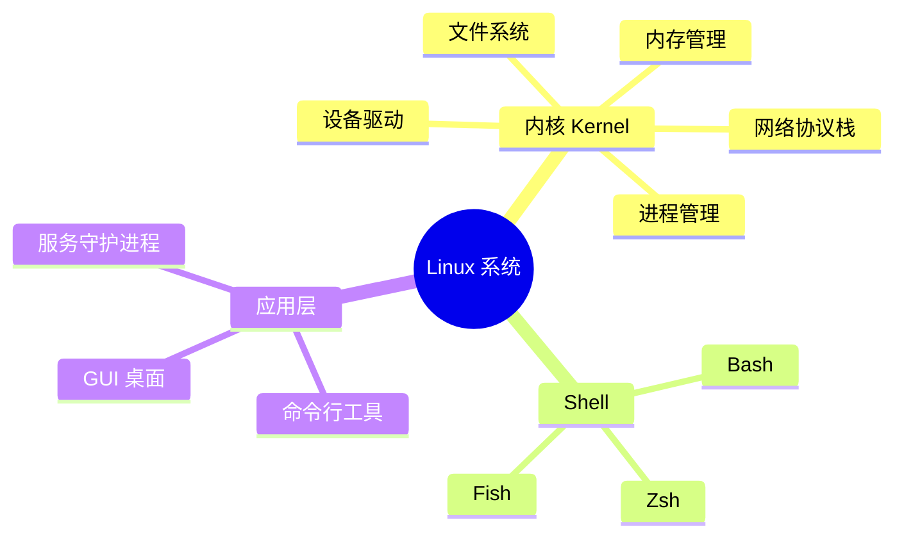
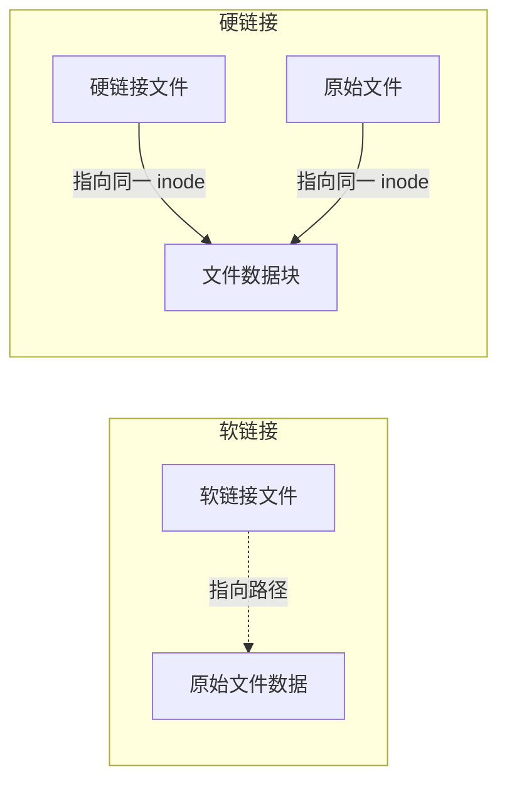

## 目录

1. [Linux 系统概述](#1-linux-系统概述)
2. [Linux 文件系统结构](#2-linux-文件系统结构)
3. [终端与 Shell 基础](#3-终端与-shell-基础)
4. [文件和目录操作命令](#4-文件和目录操作命令)
5. [文件查看与编辑命令](#5-文件查看与编辑命令)
6. [用户和权限管理](#6-用户和权限管理)
7. [进程管理命令](#7-进程管理命令)
8. [磁盘与存储管理](#8-磁盘与存储管理)
9. [网络相关命令](#9-网络相关命令)
10. [软件包管理](#10-软件包管理)
11. [系统信息与监控](#11-系统信息与监控)
12. [压缩与归档](#12-压缩与归档)
13. [文本处理三剑客](#13-文本处理三剑客)
14. [Shell 脚本基础](#14-shell-脚本基础)
15. [实用技巧与快捷键](#15-实用技巧与快捷键)

---

## 1. Linux 系统概述

### 什么是 Linux？

**Linux** 是一个开源的类 Unix 操作系统内核，由 Linus Torvalds 于 1991 年首次发布。如今，Linux 已成为服务器领域的主导操作系统，也是 Android 系统的底层核心。



### 主流 Linux 发行版

| 发行版 | 包管理器 | 适用场景 | 特点 |
|--------|----------|----------|------|
| **Ubuntu** | `apt` | 桌面/服务器 | 用户友好，社区活跃 |
| **CentOS/RHEL** | `yum`/`dnf` | 企业服务器 | 稳定可靠，长期支持 |
| **Debian** | `apt` | 服务器 | 极度稳定，自由软件 |
| **Arch Linux** | `pacman` | 极客/开发 | 滚动更新，高度定制 |
| **Kali Linux** | `apt` | 安全测试 | 预装渗透测试工具 |
| **Alpine** | `apk` | 容器/Docker | 极致轻量，安全 |

---

## 2. Linux 文件系统结构

### 目录树结构

Linux 采用**单一根目录**的树状结构，所有文件和设备都从 `/` 开始。

```
/                           # 根目录
├── /bin                    # 基本系统命令（ls, cp, mv 等）
├── /boot                   # 启动文件（内核、grub）
├── /dev                    # 设备文件（硬盘、终端等）
├── /etc                    # 系统配置文件
│   ├── /ssh/               # SSH 配置
│   ├── /nginx/             # Nginx 配置
│   └── /systemd/           # Systemd 服务配置
├── /home                   # 用户主目录
│   ├── /alice/
│   └── /bob/
├── /lib                    # 系统库文件
├── /media                  # 挂载点（U盘、光盘）
├── /mnt                    # 临时挂载点
├── /opt                    # 第三方软件
├── /proc                   # 进程和内核信息（虚拟文件系统）
├── /root                   # root 用户主目录
├── /run                    # 运行时临时文件
├── /sbin                   # 系统管理命令
├── /srv                    # 服务数据目录
├── /sys                    # 系统硬件信息（虚拟文件系统）
├── /tmp                    # 临时文件（重启清空）
├── /usr                    # 用户程序和数据
│   ├── /bin/               # 用户命令
│   ├── /lib/               # 用户库
│   ├── /local/             # 本地编译安装的软件
│   └── /share/             # 共享数据
└── /var                    # 可变数据（日志、缓存）
    ├── /log/               # 日志文件
    ├── /cache/             # 缓存
    └── /spool/             # 队列任务
```

### 路径类型

```bash
# 绝对路径 - 从根目录 / 开始
/home/alice/Documents/file.txt
/etc/nginx/nginx.conf

# 相对路径 - 从当前目录开始
./file.txt           # 当前目录下的文件
../file.txt          # 上级目录下的文件
../../etc/config     # 上两级目录下的文件
~                    # 当前用户的主目录
~/Downloads          # 当前用户的下载目录
```

---

## 3. 终端与 Shell 基础

### 什么是 Shell？

**Shell** 是用户与 Linux 内核之间的**命令解释器**。你输入命令，Shell 将其翻译给内核执行，然后将结果返回给你。


### 常用 Shell

```bash
# 查看当前使用的 Shell
echo $SHELL          # 输出: /bin/bash

# 查看系统中可用的 Shell
cat /etc/shells

# 切换 Shell（需要重新登录生效）
chsh -s /bin/zsh
```

### 命令基本格式

```bash
command [-options] [arguments]

# 示例:
ls -l /home           # ls 是命令, -l 是选项, /home 是参数
tar -xzvf file.tar.gz # tar 是命令, -xzvf 是组合选项, file.tar.gz 是参数
```

### 获取帮助

```bash
# man - 查看命令手册（最详细）
man ls               # 按 q 退出

# --help - 查看命令帮助（简洁）
ls --help

# info - 查看信息页（GNU 风格）
info coreutils

# whatis - 一句话描述命令
whatis ls

# apropos - 搜索相关命令
apropos network

# tldr - 社区维护的简化帮助（需安装）
tldr tar
```

---

## 4. 文件和目录操作命令

### 目录导航

```bash
# pwd - 显示当前工作目录
pwd                  # /home/alice

# cd - 切换目录
cd /etc              # 进入 /etc 目录
cd ~                 # 回到用户主目录
cd -                 # 回到上一个目录
cd ..                # 回到上级目录
cd ../..             # 回到上两级目录
cd                   # 直接回车，等同于 cd ~

# ls - 列出目录内容
ls                   # 列出当前目录内容
ls -l                # 详细列表（长格式）
ls -a                # 显示所有文件（包括隐藏文件）
ls -la               # 组合：详细列表 + 隐藏文件
ls -lh               # 人类可读的文件大小（K, M, G）
ls -lt               # 按修改时间排序（最新的在前）
ls -ltr              # 按修改时间排序（最旧的在前）
ls -R                # 递归列出所有子目录
ls -S                # 按文件大小排序
ls *.txt             # 列出所有 .txt 文件
```

### 目录操作

```bash
# mkdir - 创建目录
mkdir mydir              # 创建单个目录
mkdir -p a/b/c/d         # 递归创建多级目录
mkdir -m 755 mydir       # 创建时指定权限

# rmdir - 删除空目录
rmdir emptydir           # 只能删除空目录

# rm - 删除文件或目录
rm file.txt              # 删除文件
rm -r dir/               # 递归删除目录及其内容
rm -rf dir/              # 强制递归删除（危险！不提示确认）
rm -i file.txt           # 删除前逐一确认
rm -v file.txt           # 显示删除过程
rm *.log                 # 删除所有 .log 文件
```

> ⚠️ **警告**：`rm -rf` 非常危险，没有回收站，删除后无法恢复！

### 文件操作

```bash
# touch - 创建空文件或更新文件时间戳
touch newfile.txt            # 创建空文件
touch file{1..10}.txt        # 批量创建 file1.txt ~ file10.txt

# cp - 复制文件或目录
cp source.txt dest.txt       # 复制文件
cp -r source_dir/ dest_dir/  # 递归复制目录
cp -i source.txt dest.txt    # 覆盖前确认
cp -v source.txt dest.txt    # 显示复制过程
cp -p source.txt dest.txt    # 保留文件属性（权限、时间戳）
cp -a source_dir/ dest_dir/  # 归档复制（保留所有属性）

# mv - 移动或重命名文件/目录
mv oldname.txt newname.txt   # 重命名
mv file.txt /home/alice/     # 移动文件
mv -i old new                # 覆盖前确认
mv *.txt archive/            # 移动所有 .txt 文件

# ln - 创建链接
ln -s /path/to/target linkname   # 创建软链接（符号链接）
ln /path/to/target linkname      # 创建硬链接
```

### 软链接 vs 硬链接



```bash
# 软链接（符号链接）
ln -s /usr/bin/python3 /usr/bin/python
# 类似 Windows 快捷方式，原始删除则链接失效

# 硬链接
ln /home/alice/file.txt /home/alice/hardlink
# 多个文件名指向同一数据块，删除原始不影响链接
```

---

## 5. 文件查看与编辑命令

### 文件内容查看

```bash
# cat - 连接并显示文件内容
cat file.txt                    # 显示整个文件
cat -n file.txt                 # 显示行号
cat file1.txt file2.txt         # 合并显示多个文件
cat file1.txt > combined.txt    # 合并保存到新文件

# less - 分页查看文件（推荐，可前后翻页）
less largefile.txt              # 分页查看
# 快捷键: Space(下一页) b(上一页) /搜索 q(退出) g(开头) G(结尾)

# more - 分页查看文件（只能向前翻页）
more file.txt

# head - 查看文件开头
head file.txt                   # 默认显示前10行
head -n 20 file.txt             # 显示前20行
head -c 100 file.txt            # 显示前100个字节

# tail - 查看文件末尾
tail file.txt                   # 默认显示最后10行
tail -n 20 file.txt             # 显示最后20行
tail -f /var/log/syslog         # 实时追踪文件更新（极常用！）
tail -F /var/log/syslog         # 追踪文件更新，文件被删除重建后继续追踪

# wc - 统计字数、行数、字节数
wc file.txt                     # 显示: 行数 单词数 字节数
wc -l file.txt                  # 只显示行数
wc -w file.txt                  # 只显示单词数
wc -c file.txt                  # 只显示字节数

# nl - 带行号显示文件
nl file.txt
```

### 使用 Vim 编辑文件

```bash
# 打开/创建文件
vim file.txt
vi file.txt

# Vim 三种模式:
# 1. 普通模式 (Normal) - 默认，用于导航和操作
# 2. 插入模式 (Insert) - 输入文本
# 3. 命令模式 (Command) - 执行保存、退出等操作
```

| 快捷键 | 模式 | 功能 |
|--------|------|------|
| `i` | Normal → Insert | 在光标前插入 |
| `a` | Normal → Insert | 在光标后插入 |
| `o` | Normal → Insert | 在下一行插入 |
| `Esc` | Insert → Normal | 返回普通模式 |
| `:w` | Normal → Command | 保存 |
| `:q` | Normal → Command | 退出 |
| `:wq` / `ZZ` | Normal → Command | 保存并退出 |
| `:q!` | Normal → Command | 强制退出不保存 |
| `dd` | Normal | 删除当前行 |
| `yy` | Normal | 复制当前行 |
| `p` | Normal | 粘贴 |
| `u` | Normal | 撤销 |
| `Ctrl+r` | Normal | 重做 |
| `/search` | Normal | 搜索文本 |
| `:set nu` | Normal → Command | 显示行号 |

### 使用 Nano 编辑文件

```bash
nano file.txt         # 底部有快捷键提示，更友好
# Ctrl+O 保存, Ctrl+X 退出, Ctrl+K 剪切, Ctrl+U 粘贴
```

---

## 6. 用户和权限管理

### 用户管理

```bash
# whoami - 查看当前用户名
whoami

# id - 查看用户ID和组信息
id                   # 显示 uid, gid, groups
id alice             # 查看指定用户信息

# who / w - 查看当前登录用户
who                  # 列出登录用户
w                    # 更详细：包括用户正在做什么

# last - 查看登录历史
last                 # 显示登录历史记录
last -n 10           # 只显示最近10条

# 用户管理（需要 root 权限）
sudo useradd alice                    # 创建用户
sudo useradd -m -s /bin/bash bob     # 创建用户（指定主目录和Shell）
sudo passwd alice                     # 设置/修改用户密码
sudo usermod -aG sudo alice          # 将用户加入 sudo 组
sudo userdel alice                    # 删除用户
sudo userdel -r alice                 # 删除用户及其主目录
```

### 文件权限系统

Linux 文件权限基于三种角色和三种权限：

```
  -  rw-  r--  r--    alice  staff    1024  Jun 27 19:00  file.txt
  |  |    |    |
  |  |    |    └── 其他用户权限 (other)
  |  |    └─────── 用户组权限 (group)
  |  └──────────── 所有者权限 (owner)
  └─────────────── 文件类型 (-文件, d目录, l链接)
```

| 权限 | 数字 | 文件 | 目录 |
|------|------|------|------|
| **r** (read) | 4 | 读取文件内容 | 列出目录内容 |
| **w** (write) | 2 | 修改文件内容 | 创建/删除目录中文件 |
| **x** (execute) | 1 | 执行文件 | 进入目录 |

### 权限操作命令

```bash
# chmod - 修改文件权限
chmod 755 script.sh              # 数字方式: rwxr-xr-x
chmod u+x script.sh              # 符号方式: 给所有者加执行权
chmod g-w file.txt               # 移除组写权限
chmod o+r file.txt               # 给其他用户加读权限
chmod -R 755 dir/                # 递归修改目录权限

# 权限数字速查
# 7 = rwx (4+2+1)    5 = r-x (4+0+1)    0 = ---
# 6 = rw- (4+2+0)    4 = r-- (4+0+0)

# chown - 修改文件所有者
sudo chown alice file.txt             # 修改所有者
sudo chown alice:staff file.txt       # 同时修改所有者和组
sudo chown -R alice:staff dir/        # 递归修改

# chgrp - 修改文件所属组
sudo chgrp staff file.txt
```

### sudo 权限

```bash
# 以 root 身份执行单条命令
sudo command

# 切换到 root 用户
sudo su -
sudo -i

# 编辑 sudoers 文件（危险！使用 visudo）
sudo visudo

# 无密码 sudo（在 sudoers 中配置）
alice ALL=(ALL) NOPASSWD: ALL
```

---

## 7. 进程管理命令

### 进程查看

```bash
# ps - 查看进程快照
ps                      # 当前终端进程
ps aux                  # 系统所有进程（BSD 格式）
ps -ef                  # 系统所有进程（Unix 格式）
ps -ef | grep nginx     # 查找特定进程

# ps aux 输出列说明:
# USER  PID  %CPU  %MEM  VSZ   RSS  TTY  STAT  START  TIME  COMMAND
# 用户  进程ID CPU% 内存% 虚拟内存 物理内存 终端 状态  启动时间 运行时间 命令

# top - 实时进程监控（交互式）
top                     # 实时显示进程，按 q 退出
# 快捷键: M(按内存排序) P(按CPU排序) k(杀死进程) 1(查看每个CPU核心)

# htop - 更友好的 top（需安装）
htop

# pgrep - 按名称查找进程ID
pgrep nginx             # 查找nginx的PID
pgrep -u alice          # 查找alice用户的所有进程
pgrep -f "python app"   # 查找包含特定命令的进程

# pidof - 查找程序的进程ID
pidof sshd
```

### 进程控制

```bash
# kill - 向进程发送信号
kill PID                # 默认发送 TERM 信号（礼貌终止）
kill -9 PID             # 发送 KILL 信号（强制杀死）
kill -15 PID            # 发送 TERM 信号
kill -l                 # 列出所有信号

# 常用信号:
# 1  (HUP)   - 重新加载配置
# 2  (INT)   - 中断（等同于 Ctrl+C）
# 9  (KILL)  - 强制终止（无法被捕获）
# 15 (TERM)  - 优雅终止（默认）
# 19 (STOP)  - 暂停进程
# 18 (CONT)  - 继续运行

# pkill - 按名称杀死进程
pkill nginx             # 杀死所有nginx进程
pkill -f "python app"   # 按完整命令匹配

# killall - 按名称杀死所有匹配进程
killall chrome

# 进程前后台切换
command &               # 在后台启动command
Ctrl+Z                  # 暂停当前前台进程
jobs                    # 查看后台任务
fg %1                   # 将任务1调到前台
bg %1                   # 在后台继续运行任务1
nohup command &         # 后台运行，退出终端不中断

# 示例：后台运行长时间任务
nohup python train.py > output.log 2>&1 &
# nohup: 不受终端关闭影响
# > output.log: 标准输出重定向
# 2>&1: 标准错误也重定向到同一文件
# &: 后台运行
```

---

## 8. 磁盘与存储管理

```bash
# df - 查看磁盘空间使用情况
df -h                   # 人类可读格式显示
df -hT                  # 同时显示文件系统类型
df -i                   # 查看 inode 使用情况

# du - 查看目录/文件占用空间
du -sh *               # 当前目录下每个文件/文件夹的大小
du -sh /home/alice     # 查看指定目录总大小
du -h --max-depth=1    # 只显示一级子目录大小
du -sh * | sort -hr    # 按大小排序

# mount - 挂载文件系统
mount                   # 查看所有挂载
mount /dev/sdb1 /mnt   # 挂载分区
mount -t nfs server:/share /mnt  # 挂载 NFS

# umount - 卸载文件系统
umount /mnt

# lsblk - 列出块设备
lsblk                   # 显示磁盘和分区
lsblk -f                # 显示文件系统类型和UUID

# fdisk - 分区管理
sudo fdisk -l           # 列出所有磁盘和分区
sudo fdisk /dev/sdb     # 管理 /dev/sdb 磁盘

# blkid - 查看块设备UUID
blkid
```

---

## 9. 网络相关命令

### 网络配置查看

```bash
# ip - 现代网络配置工具（取代 ifconfig）
ip addr                 # 查看IP地址
ip addr show eth0       # 查看特定网卡
ip link                 # 查看网络接口状态
ip route                # 查看路由表

# ifconfig - 传统网络配置（需安装 net-tools）
ifconfig                # 查看所有网卡
ifconfig eth0           # 查看特定网卡

# ping - 测试网络连通性
ping google.com         # 持续ping（Ctrl+C 停止）
ping -c 4 google.com    # 只发4个包
ping -i 0.5 google.com  # 间隔0.5秒发一个包

# ss - 查看套接字统计（取代 netstat）
ss -tlnp                # 查看所有监听的TCP端口
ss -tlnp | grep :80     # 查看80端口是谁在监听
ss -an                  # 查看所有连接

# netstat - 传统网络统计
netstat -tlnp           # 查看监听端口
netstat -an | grep 3306 # 查看3306端口连接
```

### 网络请求与传输

```bash
# curl - URL 数据传输工具（API调试神器）
curl https://api.example.com              # GET 请求
curl -X POST https://api.example.com/data # POST 请求
curl -H "Content-Type: application/json" \
     -d '{"key":"value"}' url             # 带JSON数据
curl -O https://example.com/file.zip      # 下载文件（保留原名）
curl -o myfile.zip https://...            # 下载并重命名
curl -I https://example.com               # 只查看响应头
curl -v https://example.com               # 详细输出（调试用）
curl -L https://short.url                 # 跟随重定向
curl -u user:pass https://api.example.com # HTTP基本认证

# wget - 文件下载工具
wget https://example.com/file.zip         # 下载文件
wget -c https://example.com/file.zip      # 断点续传
wget -r -np https://example.com/docs/     # 递归下载整个目录

# scp - 安全复制（基于SSH）
scp file.txt user@server:/path/           # 上传到远程
scp user@server:/path/file.txt ./         # 从远程下载
scp -r dir/ user@server:/path/            # 递归复制目录
scp -P 2222 file.txt user@server:/path/   # 指定端口

# rsync - 高效同步工具
rsync -avz source/ dest/                  # 同步目录
rsync -avz --delete source/ dest/         # 同步并删除目标多余文件
rsync -avz -e "ssh -p 2222" source/ user@server:/dest/
```

### 防火墙（ufw）

```bash
# ufw - Ubuntu 防火墙（Uncomplicated Firewall）
sudo ufw status                  # 查看防火墙状态
sudo ufw enable                  # 启用防火墙
sudo ufw disable                 # 禁用防火墙
sudo ufw allow 22                # 允许SSH端口
sudo ufw allow 80/tcp            # 允许HTTP
sudo ufw allow 443               # 允许HTTPS
sudo ufw allow from 192.168.1.100  # 允许特定IP
sudo ufw delete allow 80         # 删除规则
sudo ufw reset                   # 重置防火墙
```

---

## 10. 软件包管理

### Debian/Ubuntu (apt)

```bash
# 更新软件源列表
sudo apt update

# 升级所有已安装的软件
sudo apt upgrade
sudo apt full-upgrade      # 更彻底的升级（可删除冲突包）

# 安装软件
sudo apt install nginx
sudo apt install vim git curl -y   # 安装多个，-y自动确认

# 搜索软件
apt search keyword
apt-cache search keyword

# 查看软件信息
apt show nginx

# 删除软件
sudo apt remove nginx           # 删除软件，保留配置
sudo apt purge nginx            # 删除软件和配置
sudo apt autoremove             # 删除不再需要的依赖

# 清理缓存
sudo apt clean                  # 清理所有下载的包缓存
sudo apt autoclean              # 清理过时的包缓存

# 列出已安装的软件
apt list --installed
dpkg -l                         # 更详细
```

### CentOS/RHEL/Fedora (yum/dnf)

```bash
# RHEL 7及以前使用 yum，RHEL 8+/Fedora 使用 dnf
# dnf 是 yum 的下一代，语法几乎相同

# 搜索和安装
sudo yum search nginx
sudo yum install nginx -y
sudo dnf install nginx -y

# 更新
sudo yum update
sudo yum upgrade

# 删除
sudo yum remove nginx

# 清理缓存
sudo yum clean all

# 列出
yum list installed
yum repolist          # 查看已启用的仓库
```

### 从源码编译安装

```bash
# 经典三步走
./configure --prefix=/usr/local/myapp
make -j$(nproc)        # 使用所有CPU核心编译
sudo make install

# 卸载
sudo make uninstall
```

---

## 11. 系统信息与监控

```bash
# uname - 系统基本信息
uname -a                # 全部信息
uname -r                # 内核版本
uname -m                # 机器架构（x86_64, aarch64）

# hostnamectl - 主机名信息
hostnamectl             # 详细主机信息
hostnamectl set-hostname myserver   # 设置主机名

# lsb_release - 发行版信息
lsb_release -a
cat /etc/os-release     # 替代方案

# uptime - 系统运行时间
uptime                  # 运行时间 + 负载

# free - 内存使用情况
free -h                 # 人类可读格式
free -m                 # 以MB为单位

# lscpu - CPU信息
lscpu

# lsblk - 块设备信息
lsblk

# lspci - PCI设备
lspci | grep -i network    # 网卡信息
lspci | grep -i vga        # 显卡信息

# lsusb - USB设备
lsusb

# dmidecode - 硬件详细信息
sudo dmidecode -t memory    # 内存信息
sudo dmidecode -t system    # 系统信息

# 系统负载
cat /proc/loadavg           # 1分钟,5分钟,15分钟负载
w                           # 负载 + 用户活动
```

### 日志查看

```bash
# journalctl - systemd 日志（主流）
journalctl -u nginx             # 查看nginx服务日志
journalctl -u nginx -f          # 实时追踪
journalctl -u nginx --since today  # 今天的日志
journalctl -u nginx -n 50       # 最近50行
journalctl --since "2026-06-27" --until "2026-06-28"

# 传统日志文件
cat /var/log/syslog              # Debian/Ubuntu 系统日志
cat /var/log/messages            # CentOS/RHEL 系统日志
tail -f /var/log/auth.log        # 认证日志（登录记录）
tail -f /var/log/nginx/access.log  # Nginx访问日志
tail -f /var/log/nginx/error.log   # Nginx错误日志
```

---

## 12. 压缩与归档

### tar - 归档与压缩

```bash
# 创建压缩包
tar -czvf archive.tar.gz dir/     # 创建 .tar.gz (gzip压缩)
tar -cjvf archive.tar.bz2 dir/    # 创建 .tar.bz2 (bzip2压缩)
tar -cJvf archive.tar.xz dir/     # 创建 .tar.xz (xz压缩，压缩率最高)

# 解压
tar -xzvf archive.tar.gz          # 解压 .tar.gz
tar -xjvf archive.tar.bz2         # 解压 .tar.bz2
tar -xJvf archive.tar.xz          # 解压 .tar.xz
tar -xvf archive.tar -C /target/  # 解压到指定目录

# tar 选项记忆:
# c = Create（创建）  x = eXtract（解压）
# z = gZip            j = bZip2        J = xZ
# v = Verbose（显示过程）  f = File（指定文件名）

# 查看压缩包内容（不解压）
tar -tzvf archive.tar.gz
```

### 其他压缩工具

```bash
# gzip / gunzip
gzip file.txt               # 压缩为 file.txt.gz
gunzip file.txt.gz          # 解压
gzip -d file.txt.gz         # 同上
gzip -9 file.txt            # 最高压缩率

# zip / unzip
zip -r archive.zip dir/     # 压缩目录
unzip archive.zip           # 解压
unzip -l archive.zip        # 查看内容不解压

# 7z（需安装 p7zip-full）
7z a archive.7z dir/        # 创建 .7z
7z x archive.7z             # 解压（保留目录结构）
7z l archive.7z             # 查看内容
```

---

## 13. 文本处理三剑客

### grep - 文本搜索

```bash
# 基本搜索
grep "pattern" file.txt              # 搜索匹配行
grep -i "pattern" file.txt           # 忽略大小写
grep -v "pattern" file.txt           # 反向搜索（不匹配的行）
grep -r "pattern" /path/to/dir/      # 递归搜索目录
grep -n "pattern" file.txt           # 显示行号
grep -c "pattern" file.txt           # 统计匹配行数
grep -l "pattern" *.txt              # 只显示文件名
grep -E "pattern1|pattern2" file.txt # 正则表达式（或使用 egrep）
grep -A 3 "pattern" file.txt         # 显示匹配行及后3行
grep -B 3 "pattern" file.txt         # 显示匹配行及前3行
grep -C 3 "pattern" file.txt         # 显示匹配行及前后各3行

# 实用示例
ps aux | grep nginx                  # 查找进程
history | grep git                   # 搜索命令历史
grep -r "TODO" src/                  # 搜索代码中的TODO
grep -v "^#" config.conf | grep -v "^$"  # 显示有效配置（去掉注释和空行）
```

### sed - 流编辑器（文本替换）

```bash
# 替换（最常用）
sed 's/old/new/' file.txt            # 每行替换第一个匹配
sed 's/old/new/g' file.txt           # 每行替换所有匹配
sed 's/old/new/gi' file.txt          # 忽略大小写全局替换
sed -i 's/old/new/g' file.txt        # 直接修改文件（-i）

# 删除行
sed '5d' file.txt                    # 删除第5行
sed '5,10d' file.txt                 # 删除5-10行
sed '/pattern/d' file.txt            # 删除匹配行

# 打印行
sed -n '5p' file.txt                 # 只打印第5行
sed -n '5,10p' file.txt              # 打印5-10行

# 插入和追加
sed '5i\New line before' file.txt    # 在第5行前插入
sed '5a\New line after' file.txt     # 在第5行后追加

# 实用示例
sed -i 's/\r$//' file.txt            # 去掉Windows换行符
sed -i '/^$/d' file.txt              # 删除空行
sed 's/[[:space:]]*$//' file.txt     # 删除行尾空格
```

### awk - 文本分析工具

```bash
# 按列操作
awk '{print $1}' file.txt             # 打印第1列
awk '{print $1, $3}' file.txt         # 打印第1列和第3列
awk -F: '{print $1, $7}' /etc/passwd  # 指定分隔符为冒号
awk -F, '{print $2}' data.csv         # 处理CSV文件

# 条件过滤
awk '$3 > 100' file.txt               # 第3列 > 100 的行
awk '$1 == "error"' log.txt           # 第1列等于 "error"
awk 'NR>=5 && NR<=10' file.txt        # 第5到10行

# 内置变量
# NR = 行号, NF = 列数, $0 = 整行, FS = 分隔符
awk '{print NR, $0}' file.txt         # 带行号打印
awk '{print NF, $0}' file.txt         # 打印列数
awk 'END {print NR}' file.txt         # 统计总行数

# 实用示例
awk '{sum+=$3} END {print sum}' data.txt   # 对第3列求和
awk '{if($3>80) print $1,"优秀"; else print $1,"继续努力"}' score.txt
df -h | awk 'NR>1 {print $5, $6}'          # 提取磁盘使用率
```

---

## 14. Shell 脚本基础

### 第一个脚本

```bash
#!/bin/bash
# 这是一个注释

echo "Hello, World!"
echo "当前用户: $(whoami)"
echo "当前目录: $(pwd)"
echo "当前时间: $(date)"
```

```bash
# 运行脚本
chmod +x script.sh        # 添加执行权限
./script.sh               # 执行
bash script.sh            # 或直接用bash执行
```

### 变量

```bash
#!/bin/bash

# 定义变量（= 两边不能有空格！）
name="Alice"
age=25

# 使用变量
echo "Name: $name"
echo "Age: ${age}"           # ${} 用于区分变量边界
echo "Hello, ${name}!"       # 推荐写法

# 特殊变量
echo "脚本名: $0"
echo "第一个参数: $1"
echo "第二个参数: $2"
echo "参数个数: $#"
echo "所有参数: $@"
echo "退出状态: $?"
echo "当前进程PID: $$"

# 命令替换
current_date=$(date)
file_count=$(ls | wc -l)
echo "Today is $current_date"
echo "Files: $file_count"
```

### 条件判断

```bash
#!/bin/bash

# if 语句
if [ "$name" = "Alice" ]; then
    echo "Welcome, Alice!"
elif [ "$name" = "Bob" ]; then
    echo "Welcome, Bob!"
else
    echo "Who are you?"
fi

# 文件测试
if [ -f "file.txt" ]; then        # 文件是否存在
    echo "file.txt exists"
fi
if [ -d "/etc" ]; then            # 目录是否存在
    echo "/etc is a directory"
fi
if [ -x "script.sh" ]; then       # 是否可执行
    echo "script.sh is executable"
fi

# 数值比较
if [ "$age" -gt 18 ]; then        # -gt:大于  -lt:小于  -eq:等于
    echo "Adult"
fi

# 字符串比较
if [ -z "$var" ]; then            # -z: 字符串为空
    echo "var is empty"
fi
if [ -n "$var" ]; then            # -n: 字符串非空
    echo "var is not empty"
fi

# 逻辑运算
if [ -f "a.txt" ] && [ -f "b.txt" ]; then   # 与
    echo "Both exist"
fi
if [ -f "a.txt" ] || [ -f "b.txt" ]; then   # 或
    echo "At least one exists"
fi
```

### 循环

```bash
#!/bin/bash

# for 循环
for i in 1 2 3 4 5; do
    echo "Number: $i"
done

for i in {1..10}; do
    echo "Count: $i"
done

for file in *.txt; do
    echo "Processing: $file"
done

# while 循环
count=1
while [ $count -le 5 ]; do
    echo "Count: $count"
    ((count++))
done

# 读取文件每一行
while read line; do
    echo "Line: $line"
done < file.txt
```

### 函数

```bash
#!/bin/bash

# 定义函数
greet() {
    echo "Hello, $1!"
}

# 调用函数
greet "Alice"
greet "Bob"

# 带返回值的函数
add() {
    result=$(($1 + $2))
    echo $result
}

sum=$(add 5 3)
echo "5 + 3 = $sum"
```

---

## 15. 实用技巧与快捷键

### 终端快捷键

| 快捷键 | 功能 |
|--------|------|
| `Ctrl+C` | 终止当前命令 |
| `Ctrl+D` | 退出当前终端 / EOF |
| `Ctrl+Z` | 暂停当前进程 |
| `Ctrl+L` | 清屏（等同于 clear） |
| `Ctrl+A` | 光标移到行首 |
| `Ctrl+E` | 光标移到行尾 |
| `Ctrl+U` | 删除光标前所有内容 |
| `Ctrl+K` | 删除光标后所有内容 |
| `Ctrl+W` | 删除前一个单词 |
| `Ctrl+R` | 搜索命令历史 |
| `Ctrl+Shift+C` | 复制（终端中） |
| `Ctrl+Shift+V` | 粘贴（终端中） |
| `Tab` | 自动补全 |
| `!!` | 执行上一条命令 |
| `!$` | 上一条命令的最后一个参数 |

### 输入输出重定向

```bash
# 输出重定向
command > file.txt          # 覆盖写入（标准输出）
command >> file.txt         # 追加写入（标准输出）
command 2> error.log        # 错误输出重定向
command &> all.log          # 标准输出和错误都重定向
command > /dev/null         # 丢弃输出（黑洞）

# 输入重定向
command < input.txt
wc -l < file.txt

# 管道 - 连接多个命令
command1 | command2 | command3
# 示例:
cat access.log | grep "404" | awk '{print $1}' | sort | uniq -c | sort -rn
# 统计访问日志中返回404最多的IP
```

### 常用一行命令

```bash
# 查找最大的10个文件
find / -type f -exec du -Sh {} + | sort -rh | head -n 10

# 查找所有空文件和空目录
find . -empty

# 批量重命名文件（添加前缀）
for f in *.txt; do mv "$f" "prefix_$f"; done

# 统计代码行数
find . -name "*.py" | xargs wc -l | tail -1

# 查找包含特定字符串的文件
grep -rl "TODO" src/

# 查看目录下各文件类型数量
find . -type f | sed 's/.*\.//' | sort | uniq -c

# 快速备份文件
cp file.txt{,.bak}     # 等同于 cp file.txt file.txt.bak

# 生成随机密码
openssl rand -base64 16
cat /dev/urandom | tr -dc 'a-zA-Z0-9' | head -c 16

# 查看最常用的10条命令
history | awk '{print $2}' | sort | uniq -c | sort -rn | head -10

# 批量杀死进程
ps aux | grep process_name | awk '{print $2}' | xargs kill -9
```

### 别名与配置文件

```bash
# ~/.bashrc 或 ~/.zshrc 中定义别名
alias ll='ls -alF'
alias la='ls -A'
alias ..='cd ..'
alias ...='cd ../..'
alias gs='git status'
alias gp='git pull'
alias df='df -h'
alias du='du -sh'
alias myip='curl ifconfig.me'
alias ports='ss -tlnp'

# 使配置生效
source ~/.bashrc
# 或
. ~/.bashrc
```

### 定时任务 (Crontab)

```bash
# 格式: 分 时 日 月 周 命令
# * * * * * command

# 编辑定时任务
crontab -e

# 查看定时任务
crontab -l

# 常用示例:
0 3 * * * /backup.sh               # 每天凌晨3点执行备份
*/5 * * * * /path/to/script.sh     # 每5分钟执行
0 0 1 * * /monthly.sh              # 每月1号执行
@reboot /startup.sh                # 开机启动
```

---

## 总结

这份教程涵盖了 Linux 最核心和最常用的命令。建议按以下路径学习：

1. ✅ 先掌握**文件目录操作**（ls, cd, cp, mv, rm）
2. ✅ 学会**查看文件内容**（cat, less, head, tail）
3. ✅ 理解**权限系统**（chmod, chown）
4. ✅ 熟练使用**管道和重定向**
5. ✅ 掌握**grep** 进行文本搜索
6. ✅ 学会**进程管理**（ps, top, kill）
7. ✅ 最后学习 **Shell 脚本** 自动化任务

> 💡 **提示**：最好的学习方式就是多用！在虚拟机或云服务器上搭建一个 Linux 环境，每天用命令行完成日常操作，很快就能熟练。

---

> **参考资源**：
> - [Linux man pages](https://linux.die.net/man/)
> - [The Linux Command Line (免费书籍)](https://linuxcommand.org/)
> - [explainshell.com](https://explainshell.com/) - 解析复杂命令
