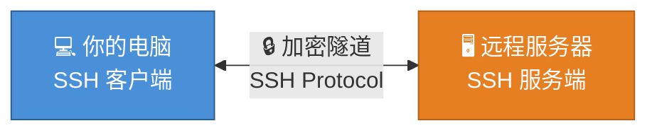
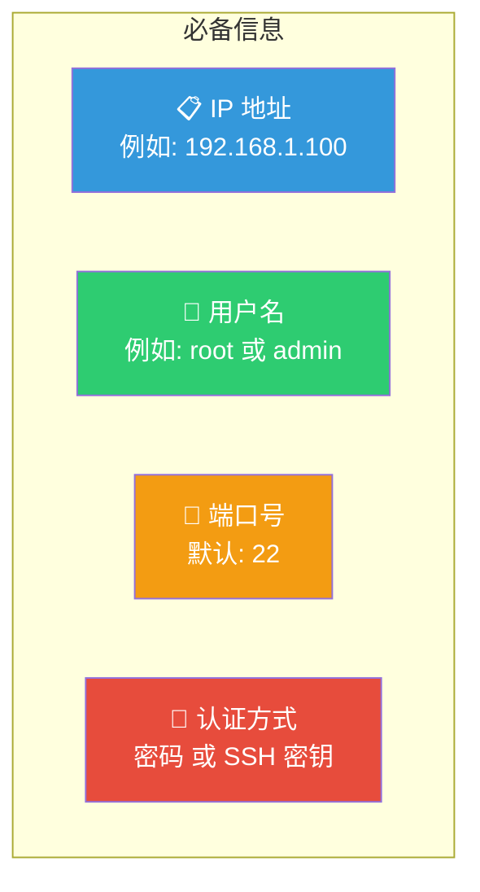
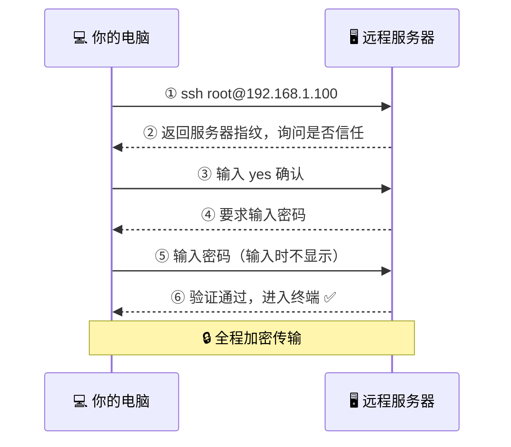
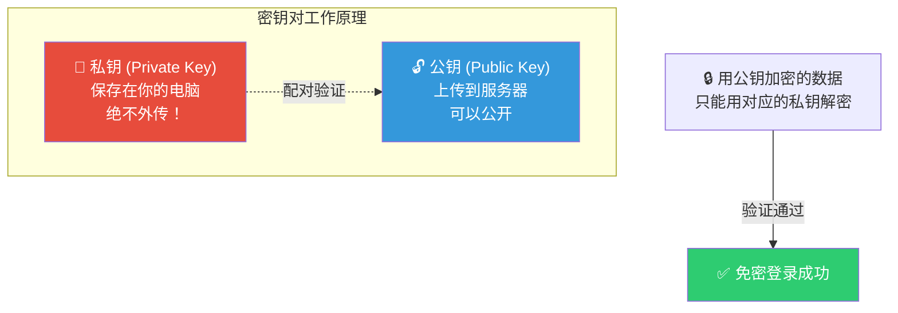
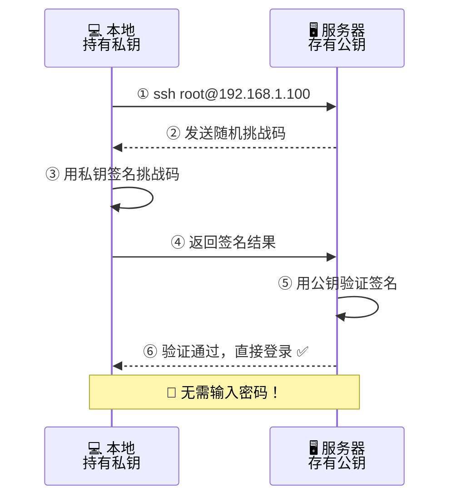
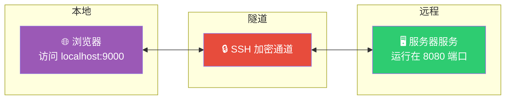
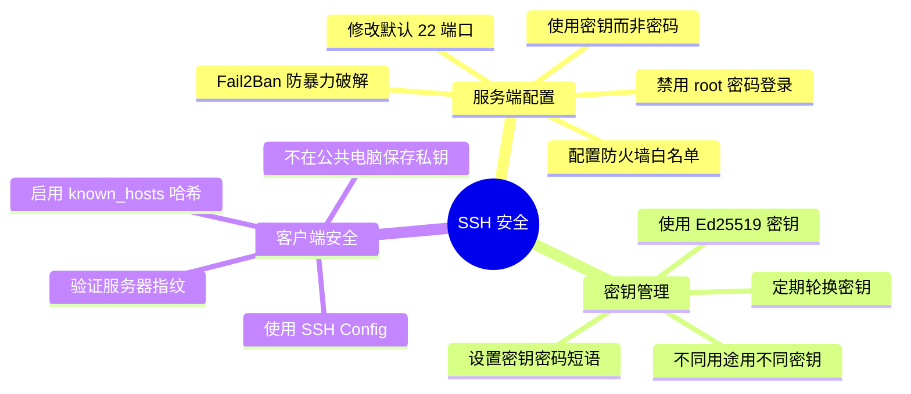
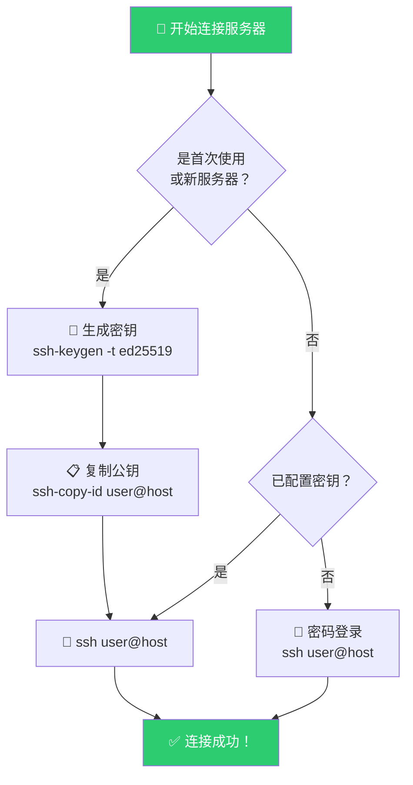

## 目录

1. [什么是 SSH](#1-什么是-ssh)
2. [准备工作](#2-准备工作)
3. [安装 SSH 客户端](#3-安装-ssh-客户端)
4. [基础连接——密码登录](#4-基础连接密码登录)
5. [进阶连接——密钥登录](#5-进阶连接密钥登录)
6. [SSH 配置文件](#6-ssh-配置文件)
7. [常用场景](#7-常用场景)
8. [安全最佳实践](#8-安全最佳实践)
9. [常见问题排查](#9-常见问题排查)

---

## 1. 什么是 SSH

**SSH**（Secure Shell）是一种加密的网络协议，用于在不安全的网络中安全地远程登录和管理服务器。它就像一条"加密隧道"，让你的电脑与远程服务器之间建立一条安全通道。



### SSH 能做什么？

| 功能 | 说明 |
|------|------|
| 🔑 **远程登录** | 在本地操作远程服务器的命令行 |
| 📁 **文件传输** | 通过 `scp` / `sftp` 安全传输文件 |
| 🔄 **端口转发** | 将远程服务映射到本地访问 |
| 🚀 **Git 操作** | 推送/拉取代码到 GitHub / GitLab |
| 🛠️ **远程执行** | 直接执行服务器上的脚本或命令 |

---

## 2. 准备工作

在开始连接之前，你需要准备以下信息：



> 💡 **提示**：如果你是首次使用，可以向服务器管理员索取以上信息。云服务器（如阿里云、腾讯云、AWS）通常在控制台提供这些信息。

---

## 3. 安装 SSH 客户端

### 3.1 Windows 系统

Windows 10/11 已**内置** OpenSSH 客户端，无需额外安装。

**验证是否已安装：**

打开 **PowerShell** 或 **CMD**，输入：

```powershell
ssh -V
```

如果显示版本号（如 `OpenSSH_for_Windows_8.6p1`），说明已安装。

> **如果未安装**，可以按以下步骤操作：

```
设置 → 应用 → 可选功能 → 添加功能 → 搜索"OpenSSH 客户端" → 安装
```

```
流程图：
┌─────────────────────────────────────────┐
│  设置 → 应用 → 可选功能                   │
│    ↓                                     │
│  点击 "添加功能"                          │
│    ↓                                     │
│  搜索框输入: OpenSSH                      │
│    ↓                                     │
│  勾选 "OpenSSH 客户端" → 安装             │
│    ↓                                     │
│  重启终端，运行 ssh -V 验证               │
└─────────────────────────────────────────┘
```

### 3.2 macOS 系统

macOS **自带** OpenSSH，打开 **终端 (Terminal)** 即可使用：

```bash
ssh -V
```

### 3.3 Linux 系统

绝大多数 Linux 发行版已预装 OpenSSH。如未安装：

```bash
# Ubuntu / Debian
sudo apt update && sudo apt install openssh-client -y

# CentOS / RHEL / Fedora
sudo yum install openssh-clients -y

# Arch Linux
sudo pacman -S openssh
```

---

## 4. 基础连接——密码登录

### 4.1 基本命令格式

```bash
ssh [用户名]@[服务器IP] -p [端口号]
```

| 参数 | 说明 | 是否必填 |
|------|------|----------|
| `用户名` | 服务器上的用户账号 | ✅ 必填 |
| `服务器IP` | 服务器的公网或内网 IP 地址 | ✅ 必填 |
| `-p 端口号` | SSH 服务端口，默认 22 时可省略 | ❌ 可选 |

### 4.2 实际操作演示



**第一步：在终端输入连接命令**

```bash
ssh root@192.168.1.100
```

```
终端显示：
┌────────────────────────────────────────────────────┐
│ PS C:\Users\Admin> ssh root@192.168.1.100         │
│                                                    │
│ The authenticity of host '192.168.1.100'           │
│ can't be established.                              │
│ ECDSA key fingerprint is                           │
│ SHA256:xxxxxxxxxxxxxxxxxxxxxxxxxxxxxxxxxxxxx.      │
│                                                    │
│ Are you sure you want to continue                  │
│ connecting (yes/no/[fingerprint])? _               │
└────────────────────────────────────────────────────┘
```

**第二步：确认服务器指纹**

首次连接会看到上面的提示，这是安全机制——SSH 在确认你是否信任该服务器。

输入 `yes` 并按回车：

```
Are you sure you want to continue connecting (yes/no/[fingerprint])? yes
```

> ⚠️ **安全提示**：如果你连接的是已知服务器但指纹突然变了，可能是**中间人攻击**，请立即停止并联系管理员！

**第三步：输入密码**

```
root@192.168.1.100's password: _
```

> 注意：输入密码时屏幕上**不会显示任何字符**（没有 `***`），这是正常的安全设计。输入完成后直接按回车。

**第四步：连接成功！**

```bash
Welcome to Ubuntu 22.04 LTS (GNU/Linux 5.15.0-91-generic)
Last login: Mon Jun 26 15:30:22 2026 from 192.168.1.50

root@server:~$ _
```

此时你已经在远程服务器上了！可以执行 Linux 命令。

### 4.3 退出连接

```bash
exit
# 或按 Ctrl + D
```

---

## 5. 进阶连接——密钥登录

密码登录每次都要输入密码，既麻烦又不安全。**SSH 密钥登录**是更推荐的方式。



### 5.1 生成 SSH 密钥对

在**本地电脑**的终端执行：

```bash
ssh-keygen -t ed25519 -C "your_email@example.com"
```

| 参数 | 含义 |
|------|------|
| `-t ed25519` | 密钥类型（Ed25519 比 RSA 更安全更快） |
| `-C "注释"` | 备注信息，方便识别（通常填邮箱） |

```
交互流程：
┌─────────────────────────────────────────────────────┐
│ PS C:\Users\Admin> ssh-keygen -t ed25519            │
│                   -C "my-pc@example.com"            │
│                                                     │
│ Generating public/private ed25519 key pair.         │
│                                                     │
│ Enter file in which to save the key                 │
│ (C:\Users\Admin\.ssh\id_ed25519): [直接按回车]      │
│                                                     │
│ Enter passphrase (empty for no passphrase): [回车]  │
│                                                     │
│ Enter same passphrase again: [回车]                 │
│                                                     │
│ Your identification has been saved in               │
│ C:\Users\Admin\.ssh\id_ed25519                      │
│ Your public key has been saved in                   │
│ C:\Users\Admin\.ssh\id_ed25519.pub                  │
│                                                     │
│ The key fingerprint is:                             │
│ SHA256:xxxxxxxxxxxxxxxxxxxxxxxxxxxxxxxxxxxxx        │
└─────────────────────────────────────────────────────┘
```

> 💡 如果不想设置密码短语（passphrase），直接按三次回车即可。

### 5.2 密钥文件说明

生成后会在 `~/.ssh/` 目录下产生两个文件：

| 文件 | 作用 | 权限要求 |
|------|------|----------|
| `id_ed25519` | 🔑 **私钥** — 保存在本地，绝不分享 | `600` (仅所有者可读写) |
| `id_ed25519.pub` | 🔓 **公钥** — 上传到服务器 | `644` (所有者读写，他人只读) |

### 5.3 上传公钥到服务器

#### 方法一：使用 ssh-copy-id（推荐）

```bash
ssh-copy-id root@192.168.1.100
```

> ⚠️ Windows 旧版可能没有 `ssh-copy-id` 命令，可用方法二。

#### 方法二：手动复制

**第一步：查看公钥内容**

```bash
# Windows PowerShell
Get-Content ~\.ssh\id_ed25519.pub

# macOS / Linux
cat ~/.ssh/id_ed25519.pub
```

输出类似：

```
ssh-ed25519 AAAAC3NzaC1lZDI1NTE5AAAAIxxxxxxxxxx my-pc@example.com
```

**第二步：将公钥添加到服务器**

先用密码登录服务器，然后执行：

```bash
mkdir -p ~/.ssh
echo "ssh-ed25519 AAAAC3NzaC1lZDI1NTE5AAAAI... 你的注释" >> ~/.ssh/authorized_keys
chmod 700 ~/.ssh
chmod 600 ~/.ssh/authorized_keys
```

> 🔒 **权限设置非常重要**：权限过宽会导致 SSH 拒绝使用密钥！

### 5.4 使用密钥登录

配置好之后，直接连接即可**免密登录**：

```bash
ssh root@192.168.1.100
```



---

## 6. SSH 配置文件

频繁连接多个服务器时，每次都输入完整命令很麻烦。SSH 配置文件 `~/.ssh/config` 可以**用别名代替长命令**。

### 6.1 创建配置文件

在 `~/.ssh/` 目录下创建 `config` 文件：

```bash
# Windows PowerShell
New-Item -Path ~\.ssh\config -ItemType File -Force

# macOS / Linux
touch ~/.ssh/config
```

### 6.2 配置示例

编辑 `~/.ssh/config`，填入以下内容：

```
# 个人云服务器
Host my-server
    HostName 192.168.1.100
    User root
    Port 22
    IdentityFile ~/.ssh/id_ed25519

# 公司跳板机
Host jumpbox
    HostName 10.0.0.50
    User admin
    Port 2222
    IdentityFile ~/.ssh/company_key

# GitHub（克隆代码用）
Host github.com
    HostName github.com
    User git
    IdentityFile ~/.ssh/id_ed25519
```

### 6.3 配置项说明

| 配置项 | 说明 | 示例 |
|--------|------|------|
| `Host` | **别名**，之后用这个名连接 | `my-server` |
| `HostName` | 实际 IP 或域名 | `192.168.1.100` |
| `User` | 登录用户名 | `root` |
| `Port` | SSH 端口 | `22` |
| `IdentityFile` | 私钥路径 | `~/.ssh/id_ed25519` |

### 6.4 使用别名连接

配置完成后，直接用别名连接，超级简洁：

```bash
# 原来
ssh root@192.168.1.100 -p 22 -i ~/.ssh/id_ed25519

# 现在
ssh my-server
```


---

## 7. 常用场景

### 7.1 文件传输（SCP）

```bash
# 上传文件到服务器
scp ./myfile.txt root@192.168.1.100:/home/user/

# 从服务器下载文件
scp root@192.168.1.100:/home/user/myfile.txt ./

# 上传整个目录
scp -r ./myfolder root@192.168.1.100:/home/user/
```


### 7.2 端口转发

将服务器的端口映射到本地：

```bash
# 将服务器 3306 端口映射到本机 3306
ssh -L 3306:localhost:3306 root@192.168.1.100

# 将服务器 8080 端口映射到本机 9000
ssh -L 9000:localhost:8080 my-server
```



**典型用例**：
- 远程访问服务器的数据库（MySQL: 3306, Redis: 6379）
- 访问服务器上运行的 Web 服务
- 内网穿透，访问公司内部系统

### 7.3 远程执行命令

```bash
# 不进入交互终端，直接执行命令并返回结果
ssh root@192.168.1.100 "ls -la /var/log"

# 执行多条命令
ssh root@192.168.1.100 "cd /app && git pull && npm run build"

# 执行需要 sudo 的命令
ssh root@192.168.1.100 "sudo systemctl restart nginx"
```

### 7.4 VS Code 远程开发

VS Code 的 **Remote - SSH** 插件让你可以直接在远程服务器上编辑代码：

```
┌──────────────────────────────────────────────────┐
│  VS Code 操作步骤：                               │
│                                                  │
│  1. 安装插件: Remote - SSH                        │
│     (ms-vscode-remote.remote-ssh)                │
│                                                  │
│  2. F1 → "Remote-SSH: Connect to Host..."        │
│                                                  │
│  3. 输入: root@192.168.1.100                     │
│                                                  │
│  4. 选择服务器上的项目目录                        │
│                                                  │
│  5. 开始像本地一样开发！                          │
└──────────────────────────────────────────────────┘
```

---

## 8. 安全最佳实践



### 8.1 核心建议

| 建议 | 说明 | 重要性 |
|------|------|--------|
| 🔑 用密钥不用密码 | 密钥长度 256 位以上，暴力破解几乎不可能 | ⭐⭐⭐⭐⭐ |
| 🚫 禁用 root 密码登录 | 修改 `/etc/ssh/sshd_config`: `PasswordAuthentication no` | ⭐⭐⭐⭐⭐ |
| 🔢 修改默认端口 | 将 22 改为其他端口，减少自动扫描攻击 | ⭐⭐⭐⭐ |
| 🛡️ 安装 Fail2Ban | 自动封禁多次登录失败的 IP | ⭐⭐⭐⭐ |
| 🔐 设置密钥密码短语 | 即使私钥泄露，攻击者也无法直接使用 | ⭐⭐⭐ |

---

## 9. 常见问题排查

### 问题 1：Connection refused（连接被拒绝）

```
ssh: connect to host 192.168.1.100 port 22: Connection refused
```

**排查清单**：

- [ ] 服务器 SSH 服务是否运行？ → `systemctl status sshd`
- [ ] 端口号是否正确？默认 22，可能已修改
- [ ] 防火墙是否开放端口？ → `sudo ufw status`
- [ ] 云服务器安全组是否放行？

### 问题 2：Permission denied（权限不足）

```
root@192.168.1.100: Permission denied (publickey,password)
```

**排查清单**：

- [ ] 密码是否正确？
- [ ] 密钥权限是否正确？ → 私钥必须 `600`，`~/.ssh` 必须 `700`
- [ ] 公钥是否正确添加到 `~/.ssh/authorized_keys`？
- [ ] 服务器是否允许密钥登录？ → 检查 `/etc/ssh/sshd_config` 中的 `PubkeyAuthentication yes`

### 问题 3：WARNING: REMOTE HOST IDENTIFICATION HAS CHANGED!

```
@@@@@@@@@@@@@@@@@@@@@@@@@@@@@@@@@@@@@@@@@@@@@@@@@@@@
@    WARNING: REMOTE HOST IDENTIFICATION HAS CHANGED!
@@@@@@@@@@@@@@@@@@@@@@@@@@@@@@@@@@@@@@@@@@@@@@@@@@@@
```

**原因**：服务器指纹变了（可能重装了系统）。

**解决**：

```bash
# 删除旧指纹记录
ssh-keygen -R 192.168.1.100

# 然后重新连接
ssh root@192.168.1.100
```

> ⚠️ 先确认是正常原因（如服务器重装），否则可能是**中间人攻击**！

### 问题 4：Connection timed out（连接超时）

```
ssh: connect to host 192.168.1.100 port 22: Connection timed out
```

**排查清单**：

- [ ] 服务器是否在线？（ping 一下试试）
- [ ] IP 地址是否正确？
- [ ] 是否在同一个网络？跨网络可能需要 VPN
- [ ] 云服务器是否有公网 IP？安全组是否放行？

---

## 📋 速查卡片



---

## 📚 常用命令汇总

```bash
# ===== 基础连接 =====
ssh user@host                    # 默认端口 22 连接
ssh user@host -p 2222           # 指定端口连接
ssh -i ~/.ssh/key user@host     # 指定私钥连接

# ===== 密钥管理 =====
ssh-keygen -t ed25519            # 生成 Ed25519 密钥
ssh-copy-id user@host            # 上传公钥到服务器
ssh-keygen -R host               # 删除 known_hosts 中的记录

# ===== 文件传输 =====
scp file user@host:/path/        # 上传文件
scp user@host:/path/file ./      # 下载文件
scp -r folder user@host:/path/   # 上传目录

# ===== 端口转发 =====
ssh -L 8080:localhost:80 host    # 本地端口转发
ssh -R 8080:localhost:80 host    # 远程端口转发

# ===== 调试 =====
ssh -v user@host                 # 详细调试信息
ssh -vvv user@host               # 最详细调试信息
```

---

> 🎉 **恭喜！** 你已经掌握了 SSH 连接服务器的全部基础知识。  
> 从密码登录到密钥认证，从基础操作到安全实践，现在你可以自信地管理远程服务器了！

---
