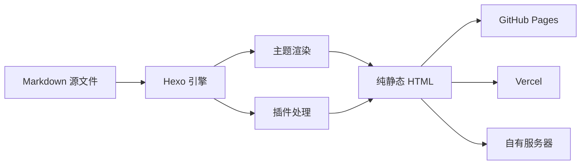
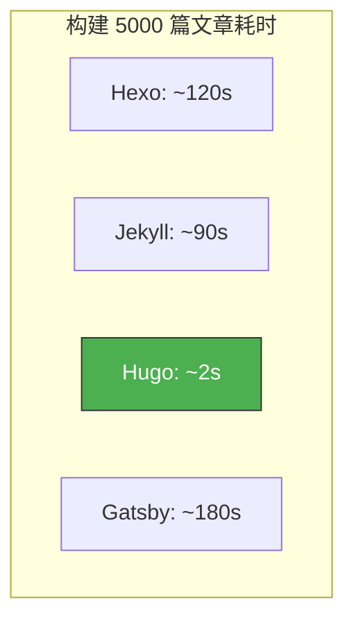
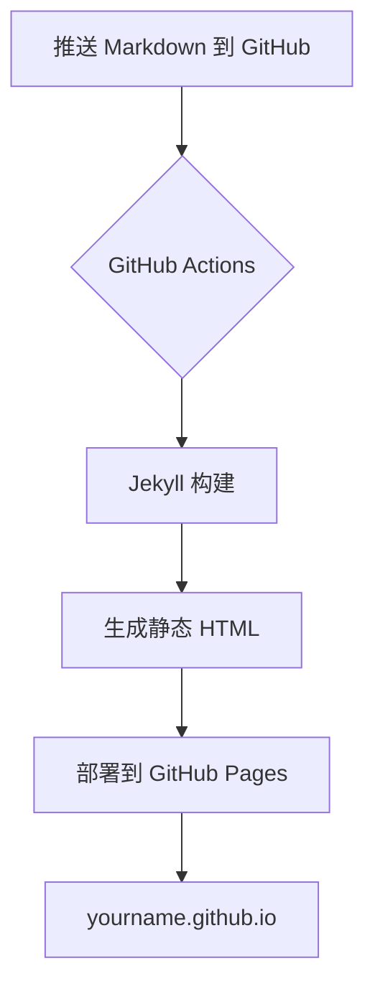
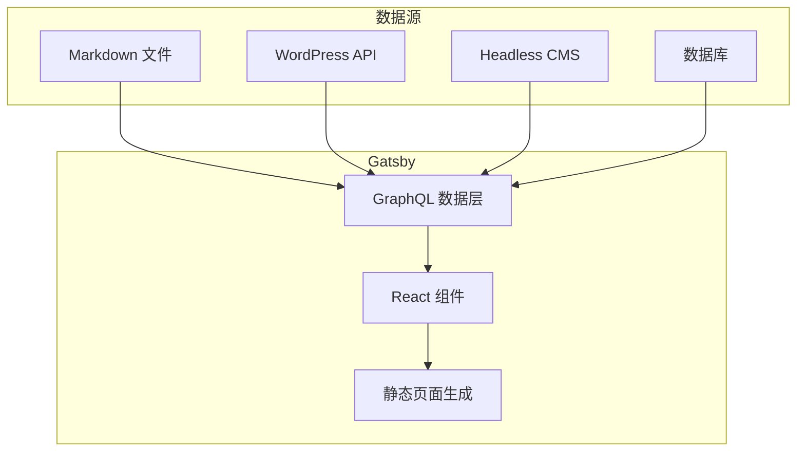
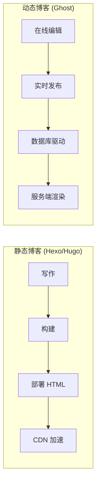
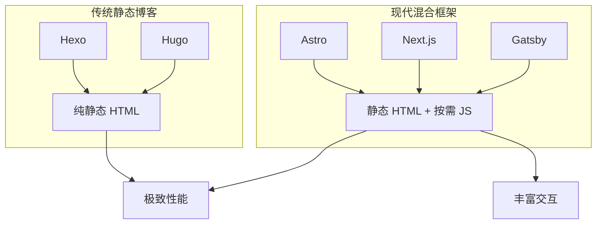
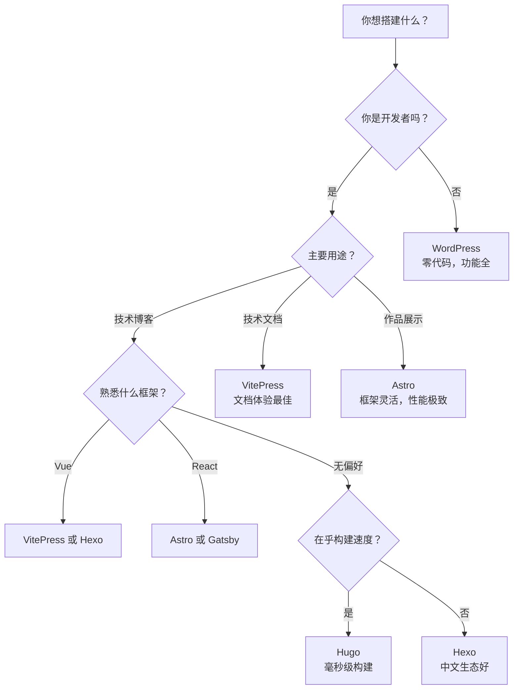

> 选对框架，让你的博客之路事半功倍。本文从**性能、生态、易用性、适用场景**四个维度，全面对比当前最流行的博客框架。

## 📋 目录

1. [总览对比表](#总览对比表)
2. [Hexo — 极速静态博客生成器](#1-hexo--极速静态博客生成器)
3. [Hugo — 编译速度之王](#2-hugo--编译速度之王)
4. [Jekyll — GitHub Pages 的黄金搭档](#3-jekyll--github-pages-的黄金搭档)
5. [Gatsby — 现代前端技术栈首选](#4-gatsby--现代前端技术栈首选)
6. [VuePress / VitePress — 技术文档利器](#5-vuepress--vitepress--技术文档利器)
7. [Ghost — 专业内容发布平台](#6-ghost--专业内容发布平台)
8. [WordPress — 全球最流行的 CMS](#7-wordpress--全球最流行的-cms)
9. [Astro — 岛屿架构，默认零 JS](#8-astro--岛屿架构默认零-js)
10. [如何选择？](#如何选择)

---

## 总览对比表

```
┌─────────────┬──────────┬──────────┬──────────┬───────────┬──────────────┐
│   框架      │  语言    │ 构建速度 │ 学习曲线 │  GitHub   │  最适合      │
│             │          │          │          │  Pages    │              │
├─────────────┼──────────┼──────────┼──────────┼───────────┼──────────────┤
│   Hexo      │ Node.js  │   ⚡⚡    │   ★☆☆    │   ✅      │ 个人博客     │
│   Hugo      │   Go     │   ⚡⚡⚡  │   ★★☆    │   ✅      │ 大型站点     │
│   Jekyll    │  Ruby    │   ⚡⚡    │   ★☆☆    │   ✅✅    │ GitHub托管   │
│   Gatsby    │  React   │   ⚡     │   ★★★    │   ✅      │ 现代Web应用  │
│   VitePress │  Vue/TS  │   ⚡⚡⚡  │   ★★☆    │   ✅      │ 技术文档     │
│   Ghost     │ Node.js  │   N/A    │   ★★☆    │   ❌      │ 内容创作     │
│   WordPress │   PHP    │   N/A    │   ★☆☆    │   ❌      │ 全能型CMS    │
│   Astro     │ JS/TS    │   ⚡⚡⚡  │   ★★☆    │   ✅      │ 内容站点     │
└─────────────┴──────────┴──────────┴──────────┴───────────┴──────────────┘
```

---

## 1. Hexo — 极速静态博客生成器


**官网**: [https://hexo.io](https://hexo.io)  
**GitHub Stars**: ⭐ 39k+  
**首发年份**: 2012

### ✨ 核心特点

| 特点 | 说明 |
|------|------|
| 🚀 **极速生成** | 数百篇文章秒级生成，Node.js 异步 IO 加持 |
| 📝 **Markdown 原生** | 支持 GitHub Flavored Markdown，写作体验极佳 |
| 🎨 **丰富主题** | 官方主题市场 300+ 主题，NexT、Butterfly 等经典主题 |
| 🔌 **插件系统** | 强大的插件架构，RSS、Sitemap、SEO 一键集成 |
| 🌍 **一键部署** | 一条命令部署到 GitHub Pages、Vercel、Netlify 等 |

### 🔧 核心命令

```bash
npm install hexo-cli -g      # 安装
hexo init my-blog            # 初始化
hexo new "我的第一篇文章"      # 新建文章
hexo generate                # 生成静态文件
hexo server                  # 本地预览
hexo deploy                  # 一键部署
```

### 📊 框架架构



### 👍 优点 & 👎 缺点

- ✅ **中文生态极好**：大量中文主题、教程和插件
- ✅ **学习曲线平缓**：前端开发者几乎零门槛
- ✅ **部署极其简单**：`hexo deploy` 一键推送
- ❌ **文章多时构建变慢**：超过 500 篇文章增量编译才有优势
- ❌ **Node.js 依赖**：需要 Node.js 环境

---

## 2. Hugo — 编译速度之王


**官网**: [https://gohugo.io](https://gohugo.io)  
**GitHub Stars**: ⭐ 76k+  
**首发年份**: 2013

### ✨ 核心特点

| 特点 | 说明 |
|------|------|
| ⚡ **极致速度** | Go 语言编译，10000 篇文章 < 1 秒构建 |
| 📦 **单二进制** | 无需安装运行时，一个可执行文件搞定 |
| 🏗️ **灵活内容** | 支持 Markdown、AsciiDoc、Org-mode 等多种格式 |
| 🌍 **多语言** | 原生多语言支持，国际化站点首选 |
| 🧩 **Taxonomies** | 强大的分类系统，自定义标签、分类、系列 |

### 🔧 核心命令

```bash
hugo new site my-blog          # 新建站点
hugo new posts/hello-world.md  # 新建文章
hugo server -D                 # 本地预览（含草稿）
hugo                           # 构建（毫秒级完成）
```

### 📊 构建性能对比



### 👍 优点 & 👎 缺点

- ✅ **速度碾压所有同类**：没有比 Hugo 更快的静态站点生成器
- ✅ **零依赖安装**：下载一个文件就能用
- ✅ **LiveReload 极快**：修改即时可见
- ❌ **模板语法独特**：Go Template 语法需要适应
- ❌ **中文主题较少**：相比 Hexo 中文资源略显不足

---

## 3. Jekyll — GitHub Pages 的黄金搭档


**官网**: [https://jekyllrb.com](https://jekyllrb.com)  
**GitHub Stars**: ⭐ 49k+  
**首发年份**: 2008（静态博客鼻祖）

### ✨ 核心特点

| 特点 | 说明 |
|------|------|
| 🏠 **GitHub Pages 原生** | GitHub 官方支持，无需构建，推送即部署 |
| 💎 **Liquid 模板** | Shopify 同款模板引擎，简单强大 |
| 📦 **丰富插件** | GitHub 官方维护大量插件 |
| 🎨 **Minima 主题** | 经典简约，适合文字创作者 |
| 🔒 **安全稳定** | Ruby 生态成熟，安全漏洞响应快 |

### 🔧 核心命令

```bash
gem install jekyll bundler     # 安装
jekyll new my-blog             # 新建站点
jekyll serve                   # 本地预览
jekyll build                   # 构建
```

### 📊 工作流程



### 👍 优点 & 👎 缺点

- ✅ **GitHub 深度集成**：最省心的部署体验
- ✅ **稳定可靠**：运行十余年，生态成熟
- ✅ **适合纯写作**：无需关心前端细节
- ❌ **Windows 环境不友好**：Ruby 在 Windows 上体验差
- ❌ **构建速度一般**：大规模站点构建较慢

---

## 4. Gatsby — 现代前端技术栈首选


**官网**: [https://www.gatsbyjs.com](https://www.gatsbyjs.com)  
**GitHub Stars**: ⭐ 55k+  
**首发年份**: 2015

### ✨ 核心特点

| 特点 | 说明 |
|------|------|
| ⚛️ **React 技术栈** | 基于 React，可以写任何现代 Web 应用 |
| 🔗 **GraphQL 数据层** | 统一的数据层，博客内容、API、CMS 全打通 |
| 📸 **图片优化** | gatsby-plugin-image 自动懒加载、WebP 转换 |
| 🔌 **4000+ 插件** | 生态极其丰富，几乎无所不能 |
| ☁️ **Gatsby Cloud** | 官方云平台，增量构建极快 |

### 📊 数据层架构



### 👍 优点 & 👎 缺点

- ✅ **前端性能极致**：代码分割、预加载、PWA 开箱即用
- ✅ **数据源极其灵活**：什么都能接，什么都能展示
- ✅ **React 生态复用**：React 开发者零学习成本
- ❌ **构建速度慢**：大型站点构建可能数十分钟
- ❌ **概念复杂**：GraphQL + Gatsby API 学习曲线陡峭

---

## 5. VuePress / VitePress — 技术文档利器


**VuePress 官网**: [https://vuepress.vuejs.org](https://vuepress.vuejs.org)  
**VitePress 官网**: [https://vitepress.dev](https://vitepress.dev)  
**GitHub Stars**: ⭐ 22k+ / 13k+

### ✨ 核心特点

| 特点 | VitePress | VuePress |
|------|-----------|----------|
| 🚀 **构建工具** | Vite（极快） | Webpack |
| 📝 **Markdown 增强** | ✅ 内置 | ✅ 内置 |
| 🎨 **默认主题** | 极简现代 | 经典文档风 |
| 🔍 **内置搜索** | ✅ 本地搜索 | ✅ Algolia |
| 📱 **响应式** | ✅ | ✅ |

### 🔧 VitePress 快速开始

```bash
npm add -D vitepress
npx vitepress init
npm run docs:dev       # 本地预览
npm run docs:build     # 构建
```

### 👍 优点 & 👎 缺点

- ✅ **文档体验一流**：侧边栏、导航、搜索开箱即用
- ✅ **VitePress 构建极快**：秒级热更新
- ✅ **Vue 生态完美契合**：可以在 Markdown 中使用 Vue 组件
- ❌ **博客功能偏弱**：更适合文档站，博客能力需二次开发
- ❌ **Vue 限定**：需要 Vue 基础

---

## 6. Ghost — 专业内容发布平台


**官网**: [https://ghost.org](https://ghost.org)  
**GitHub Stars**: ⭐ 47k+  
**首发年份**: 2013

### ✨ 核心特点

| 特点 | 说明 |
|------|------|
| ✍️ **专业编辑器** | 类 Medium 的所见即所得编辑器 + Markdown 卡片 |
| 💰 **会员系统** | 内置订阅付费、邮件通讯功能 |
| 📧 **Newsletter** | 原生邮件推送，可替代 Substack |
| 🎨 **Casper 主题** | 官方主题极美，排版一流 |
| 🔌 **Headless 模式** | 可作为 Headless CMS 供前端框架调用 |

### 📊 对比静态博客



### 👍 优点 & 👎 缺点

- ✅ **写作体验最佳**：编辑器体验远超静态博客
- ✅ **商业化能力**：会员 + 付费订阅开箱即用
- ❌ **需要服务器**：Node.js + MySQL，有运维成本
- ❌ **免费版功能受限**：Ghost(Pro) 托管费用较高

---

## 7. WordPress — 全球最流行的 CMS


**官网**: [https://wordpress.org](https://wordpress.org)  
**全球市场份额**: 🌍 **43%** 的网站使用 WordPress  
**首发年份**: 2003

### ✨ 核心特点

| 特点 | 说明 |
|------|------|
| 🌍 **市场占有率第一** | 全球 43% 的网站运行在 WordPress 上 |
| 🧩 **60000+ 插件** | 电商、SEO、表单、缓存...应有尽有 |
| 🎨 **10000+ 主题** | 从免费到高级定制，选择极多 |
| 👥 **用户角色管理** | 管理员、编辑、作者等多角色支持 |
| 🔌 **REST API** | 可作为 Headless CMS 对接现代前端 |

### 📊 生态规模

```
WordPress 生态
├── 🧩 插件: 60,000+
├── 🎨 主题: 10,000+
├── 🌍 翻译: 200+ 语言
├── 👥 社区: 全球数百万用户
└── 💼 电商: WooCommerce 覆盖 30% 在线商店
```

### 👍 优点 & 👎 缺点

- ✅ **功能最全面**：从博客到电商，什么都能做
- ✅ **零代码建站**：拖拽式编辑器，非开发者友好
- ✅ **生态无敌**：插件和主题数量碾压一切
- ❌ **性能优化复杂**：需要缓存插件、CDN 等额外配置
- ❌ **安全风险**：热门目标，需要定期更新维护
- ❌ **PHP 技术栈**：对前端开发者不友好

---

## 8. Astro — 岛屿架构，默认零 JS


**官网**: [https://astro.build](https://astro.build)  
**GitHub Stars**: ⭐ 50k+  
**首发年份**: 2021

### ✨ 核心特点

| 特点 | 说明 |
|------|------|
| 🏝️ **岛屿架构** | 页面 99% 是纯静态 HTML，交互部分像"岛屿"一样独立激活 |
| 📦 **默认零 JS** | 最终页面不含任何 JavaScript，除非你明确需要 |
| 🔌 **多框架混用** | 同一页面可同时使用 React、Vue、Svelte、Solid 组件 |
| 📝 **内容优先** | Markdown / MDX 原生支持，Content Collections API 管理内容 |
| ⚡ **极致性能** | 默认 Lighthouse 满分，首屏加载极快 |

### 🔧 核心命令

```bash
npm create astro@latest       # 创建项目
npm run dev                   # 本地预览
npm run build                 # 构建
```

### 📊 岛屿架构示意

```
传统 SPA 框架（如 Gatsby）：
┌──────────────────────────────────┐
│         整页都是 JS 水合           │  ← 200KB+ JS
│  ┌──────┐ ┌──────┐ ┌──────┐     │
│  │ Nav  │ │ 内容  │ │ 评论  │     │
│  └──────┘ └──────┘ └──────┘     │
└──────────────────────────────────┘

Astro 岛屿架构：
┌──────────────────────────────────┐
│  Nav（纯HTML）  │  内容（纯HTML）  │  ← 零 JS！
│                 │                │
│          ┌──────┴──────┐         │
│          │ 评论区(React) │         │  ← 只有这个加载 JS
│          └─────────────┘         │
└──────────────────────────────────┘
```

### 📊 与 Hexo / Hugo 的关系



### 👍 优点 & 👎 缺点

- ✅ **性能天花板极高**：默认零 JS，Lighthouse 满分是常态
- ✅ **框架无关**：React/Vue/Svelte 组件可以混在同一页面
- ✅ **学习曲线温和**：`.astro` 文件语法接近 HTML，上手极快
- ✅ **View Transitions**：内置页面过渡动画，SPA 般的浏览体验
- ❌ **不适合高交互应用**：不适合做在线协作工具、后台管理等
- ❌ **相对年轻**：2021 年才发布，部分边缘场景生态不够完善

---

## 如何选择？

### 🎯 按场景推荐



### 📊 决策矩阵

| 你的需求 | 推荐框架 | 一句话理由 |
|----------|----------|------------|
| 🎓 **初学者入门** | **Hexo** | 中文教程多，部署最简单 |
| ⚡ **追求构建速度** | **Hugo** | 万篇文章秒级构建 |
| 🏠 **GitHub 免费托管** | **Jekyll** | GitHub Pages 原生支持 |
| ⚛️ **React 开发者** | **Gatsby** | React + GraphQL 现代化 |
| 📖 **写技术文档** | **VitePress** | Vite 驱动，秒级热更新 |
| 💰 **内容变现** | **Ghost** | 内置会员 + 付费订阅 |
| 🏪 **全能型站点** | **WordPress** | 插件生态无可匹敌 |
| 🏝️ **混合框架灵活性** | **Astro** | 多框架混用 + 零 JS 默认 |

---

## 🏁 总结

| | Hexo | Hugo | Jekyll | Gatsby | VitePress | Ghost | WordPress | Astro |
|--|------|------|--------|--------|-----------|-------|-----------|-------|
| **类型** | 静态 | 静态 | 静态 | 静态 | 静态 | 动态 | 动态 | 静态 |
| **速度** | ⚡⚡ | ⚡⚡⚡ | ⚡⚡ | ⚡ | ⚡⚡⚡ | N/A | N/A | ⚡⚡⚡ |
| **上手难度** | 易 | 中 | 易 | 难 | 中 | 中 | 易 | 中 |
| **中文资源** | ⭐⭐⭐ | ⭐⭐ | ⭐⭐ | ⭐⭐ | ⭐⭐ | ⭐ | ⭐⭐⭐ | ⭐⭐ |
| **主题数量** | 300+ | 400+ | 200+ | 300+ | 50+ | 100+ | 10000+ | 200+ |
| **适用规模** | 中小型 | 任意 | 中小型 | 中大型 | 文档站 | 中大型 | 任意 | 中小型 |

---

> 💡 **个人推荐**：如果你刚入门，**Hexo + GitHub Pages** 是最省心的组合；追求极致性能选 **Hugo**；想要现代开发体验和框架灵活性选 **Astro**；做技术文档站必选 **VitePress**；想要商业变现上 **Ghost**。

---

*📅 更新于 2026-06-27 · 如有疑问欢迎讨论*
