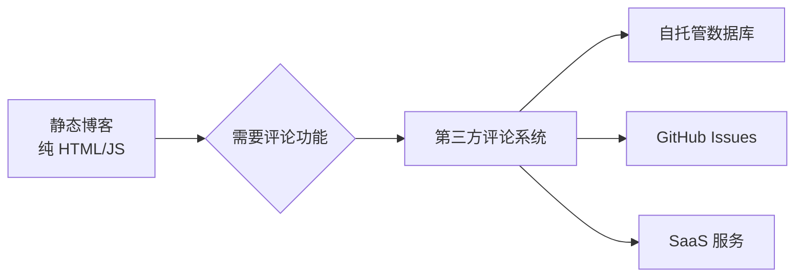
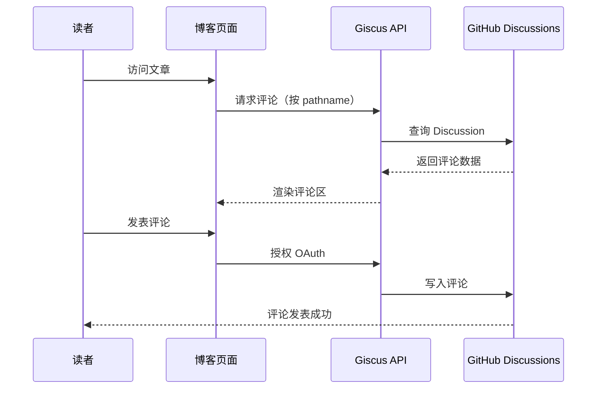
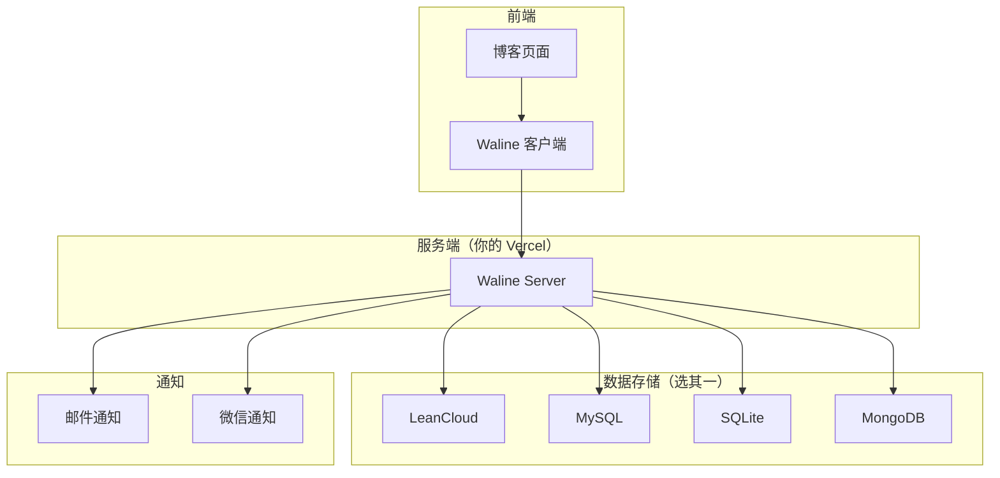
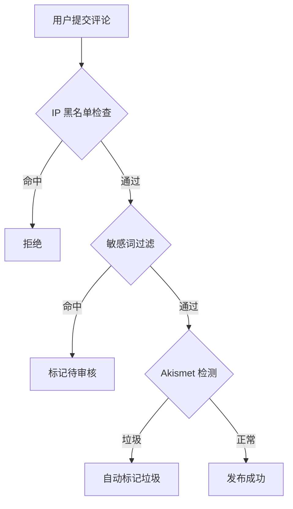
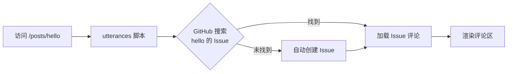
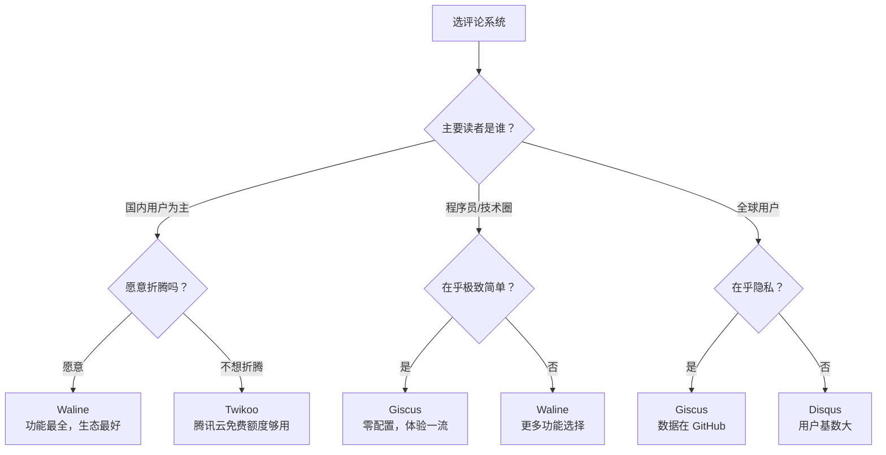

> 静态博客没有后端数据库，评论功能全靠第三方服务。本文从**数据存储、隐私、成本、界面、国内可用性**五个维度，全面对比主流评论方案。

## 📋 目录

1. [为什么需要第三方评论？](#为什么需要第三方评论)
2. [方案对比总览](#方案对比总览)
3. [Giscus — GitHub Discussions 驱动](#1-giscus--github-discussions-驱动)
4. [Waline — 国产开源全能王](#2-waline--国产开源全能王)
5. [Twikoo — 腾讯云函数轻量方案](#3-twikoo--腾讯云函数轻量方案)
6. [utterances — 极简 GitHub Issues 评论](#4-utterances--极简-github-issues-评论)
7. [Disqus — 全球最老牌评论系统](#5-disqus--全球最老牌评论系统)
8. [Artalk — 国产新星自托管方案](#6-artalk--国产新星自托管方案)
9. [Gitalk — GitHub Issues 的古典方案](#7-gitalk--github-issues-的古典方案)
10. [如何选择？](#如何选择)

---

## 为什么需要第三方评论？



静态博客只是一堆 HTML 文件，没有后端、没有数据库。要实现评论，要么自己搭后端，要么接入第三方服务——后者才是主流做法。

---

## 方案对比总览

```
┌──────────┬──────────────┬──────────┬──────────┬───────────┬──────────────┐
│   系统   │  数据存储     │  免费？  │ 国内速度  │  隐私性   │  上手难度    │
├──────────┼──────────────┼──────────┼──────────┼───────────┼──────────────┤
│  Giscus  │ GitHub 讨论   │   ✅    │   ⚡⚡    │   ⭐⭐⭐  │   极简       │
│  Waline  │ 自托管/SaaS  │   ✅    │   ⚡⚡⚡  │   ⭐⭐⭐  │   中等       │
│  Twikoo  │ 腾讯云/自托管 │   ✅    │   ⚡⚡⚡  │   ⭐⭐⭐  │   中等       │
│utterances│ GitHub Issues │   ✅    │   ⚡⚡    │   ⭐⭐⭐  │   极简       │
│  Disqus  │ 官方服务器    │   ⚠️   │   ⚡     │   ⭐     │   极简       │
│  Artalk  │ 自托管        │   ✅    │   ⚡⚡⚡  │   ⭐⭐⭐  │   中等       │
│  Gitalk  │ GitHub Issues │   ✅    │   ⚡⚡    │   ⭐⭐⭐  │   简单       │
└──────────┴──────────────┴──────────┴──────────┴───────────┴──────────────┘
```

---

## 1. Giscus — GitHub Discussions 驱动


**官网**: [https://giscus.app](https://giscus.app)  
**GitHub Stars**: ⭐ 9k+  
**数据存储**: GitHub Discussions API

### ✨ 核心特点

| 特点 | 说明 |
|------|------|
| 🗣️ **GitHub Discussions** | 利用 GitHub 原生的讨论功能，管理体验好 |
| 🎨 **自动适配主题** | 自动跟随系统亮暗模式，无需手动配置 |
| ❤️ **反应表情** | 评论可以点赞、踩、爱心等 GitHub 原生反应 |
| 📧 **回复通知** | 被回复时 GitHub 会发邮件通知 |
| 🌍 **多语言** | 支持中文等 20+ 种语言 |

### 🔧 集成方式（Hexo 示例）

```bash
# Hexo 只需在主题配置中添加
npm install hexo-next-giscus --save
```

```yml
# _config.next.yml
giscus:
  enable: true
  repo: yourname/yourname.github.io
  repo_id: "MDEwOlJlcG9zaXRvcn..."
  category: Announcements
  category_id: "DIC_kwDO..."
  mapping: pathname
```

### 📊 工作流程



### 👍 优点 & 👎 缺点

- ✅ **零成本零运维**：数据在 GitHub，GitHub 不挂它就活着
- ✅ **界面精美**：和 GitHub 风格统一，支持亮暗切换
- ✅ **评论者需 GitHub 账号**：天然防 spam
- ❌ **评论者需 GitHub 账号**：非程序员可能望而却步
- ❌ **依赖 GitHub**：GitHub 被墙则不可用（国内偶尔不稳定）

---

## 2. Waline — 国产开源全能王


**官网**: [https://waline.js.org](https://waline.js.org)  
**GitHub Stars**: ⭐ 2.5k+  
**数据存储**: 自托管（LeanCloud / MySQL / SQLite / 等）

### ✨ 核心特点

| 特点 | 说明 |
|------|------|
| 🔒 **数据完全自主** | 评论数据存在你自己的数据库里 |
| 👤 **多种登录方式** | 支持 QQ、微信、GitHub、Twitter 等社交登录 |
| 📧 **邮件通知** | 博主和评论者均可收到邮件提醒 |
| 📊 **评论统计** | 内置阅读量统计、评论数统计 |
| 🖼️ **图片上传** | 评论区支持粘贴图片上传 |

### 🔧 快速部署（Vercel 一键）

```bash
# 方式一：Vercel 部署（推荐，免费）
# 访问 https://vercel.com/new/clone?repository-url=https://github.com/walinejs/waline

# 方式二：Docker 部署
docker run -d \
  -e LEAN_ID=xxx \
  -e LEAN_KEY=xxx \
  -e LEAN_MASTER_KEY=xxx \
  -p 8360:8360 \
  lizheming/waline
```

### 📊 架构示意



### 👍 优点 & 👎 缺点

- ✅ **国内体验极佳**：支持微信/QQ 登录，国内访问快
- ✅ **数据自主可控**：数据库完全在你手里
- ✅ **功能最全面**：登录、通知、图片、统计一应俱全
- ❌ **需要部署服务端**：虽然是免费的，但有一点点门槛
- ❌ **数据迁移麻烦**：换数据库需要手动迁移

---

## 3. Twikoo — 腾讯云函数轻量方案


**官网**: [https://twikoo.js.org](https://twikoo.js.org)  
**GitHub Stars**: ⭐ 1.7k+  
**数据存储**: 腾讯云 CloudBase / 自托管 MongoDB / Vercel

### ✨ 核心特点

| 特点 | 说明 |
|------|------|
| ☁️ **腾讯云原生** | 可直接部署在腾讯云 CloudBase（有免费额度） |
| 🎨 **现代 UI** | 界面简洁美观，支持暗色模式 |
| 🔔 **多种通知** | 邮件、微信、Pushover 多渠道通知 |
| 📦 **反垃圾** | 内置 Akismet 反垃圾 + 敏感词过滤 |
| 🔒 **密码保护** | 可设置博主密码，只有你能管理评论 |

### 🔧 快速开始

```bash
# 方式一：腾讯云 CloudBase（国内用户推荐）
# 访问 https://console.cloud.tencent.com/tcb

# 方式二：Vercel + MongoDB
# 一键克隆部署到 Vercel

# 方式三：Docker
docker run -d \
  -e TWIKOO_DATA=/app/data \
  -v ./data:/app/data \
  -p 8080:8080 \
  imaegoo/twikoo
```

### 📊 反垃圾流程



### 👍 优点 & 👎 缺点

- ✅ **腾讯云免费额度够用**：个人博客完全够用
- ✅ **部署简单**：Vercel 一键部署或 Docker 一条命令
- ✅ **反垃圾能力强**：多重过滤机制
- ❌ **腾讯云依赖**：CloudBase 方案有厂商锁定风险
- ❌ **社区略小**：相比 Waline，用户群和插件稍少

---

## 4. utterances — 极简 GitHub Issues 评论


**官网**: [https://utteranc.es](https://utteranc.es)  
**GitHub Stars**: ⭐ 9k+  
**数据存储**: GitHub Issues

### ✨ 核心特点

| 特点 | 说明 |
|------|------|
| 🔌 **零配置** | 只需在页面插入一个 `<script>` 标签 |
| 🐙 **GitHub Issues** | 每篇文章自动创建一个 Issue，评论即 Issue 评论 |
| 🎨 **简单干净** | 没有任何花哨功能，纯粹的评论区 |
| 📧 **通知** | 有人回复时 GitHub 自动发邮件 |

### 🔧 集成（最简单）

```html
<!-- 在文章底部加入这段代码 -->
<script src="https://utteranc.es/client.js"
  repo="你的用户名/你的仓库名"
  issue-term="pathname"
  theme="github-light"
  crossorigin="anonymous"
  async>
</script>
```

### 📊 工作原理



### 👍 优点 & 👎 缺点

- ✅ **最简单的方案**：一行 HTML 搞定，甚至不需要构建工具
- ✅ **完全免费**：GitHub Issues 无限制
- ❌ **功能太少**：没有登录扩展、没有图片上传、没有管理后台
- ❌ **不如 Giscus**：Giscus 是它的升级替代品，体验更好

---

## 5. Disqus — 全球最老牌评论系统


**官网**: [https://disqus.com](https://disqus.com)  
**覆盖站点**: 数百万网站  
**数据存储**: Disqus 官方服务器

### ✨ 核心特点

| 特点 | 说明 |
|------|------|
| 🌍 **用户基数大** | 全球数百万人有 Disqus 账号，登录评论零门槛 |
| 📊 **后台管理强** | 评论审核、分析、垃圾过滤一应俱全 |
| 🔔 **通知完善** | 邮件通知、回复提醒 |
| 📈 **变现支持** | 付费版可去广告，免费版带广告 |

### 🔧 集成

```html
<div id="disqus_thread"></div>
<script>
  var disqus_config = function () {
    this.page.url = '文章地址';
    this.page.identifier = '文章ID';
  };
  (function() {
    var d = document, s = d.createElement('script');
    s.src = 'https://你的站点名.disqus.com/embed.js';
    s.setAttribute('data-timestamp', +new Date());
    (d.head || d.body).appendChild(s);
  })();
</script>
```

### 👍 优点 & 👎 缺点

- ✅ **傻瓜式接入**：注册一个站点 ID，复制粘贴即可
- ✅ **功能最成熟**：运营十余年，该有的功能都有
- ❌ **国内加载慢**：服务器在海外，偶尔加载不出来
- ❌ **隐私争议**：免费版会植入广告并追踪用户数据
- ❌ **数据不自主**：所有评论存在 Disqus 服务器上

---

## 6. Artalk — 国产新星自托管方案


**官网**: [https://artalk.js.org](https://artalk.js.org)  
**GitHub Stars**: ⭐ 1.8k+  
**数据存储**: 自托管（SQLite / MySQL / PostgreSQL）

### ✨ 核心特点

| 特点 | 说明 |
|------|------|
| 🎨 **极简 UI** | 设计简洁，颜值在线 |
| 🔒 **自托管** | 一条 Docker 命令部署，数据完全自主 |
| 📧 **邮件通知** | 支持 SMTP 发送通知邮件 |
| 📊 **管理后台** | 内置管理面板，可以在线审核回复 |
| 🌏 **中文优先** | 国产项目，中文支持一流 |

### 🔧 Docker 一条命令

```bash
docker run -d \
  --name artalk \
  -p 23366:23366 \
  -v $(pwd)/data:/data \
  artalk/artalk-go
```

### 👍 优点 & 👎 缺点

- ✅ **部署极简**：Docker 一条命令跑起来
- ✅ **界面好看**：颜值在国产方案中数一数二
- ✅ **管理后台内置**：不需要额外部署管理面板
- ❌ **相对小众**：插件和主题生态不如 Waline 丰富
- ❌ **邮件配置略麻烦**：不同邮箱服务商 SMTP 配置各不相同

---

## 7. Gitalk — GitHub Issues 的古典方案


**官网**: [https://github.com/gitalk/gitalk](https://github.com/gitalk/gitalk)  
**GitHub Stars**: ⭐ 7k+  
**数据存储**: GitHub Issues

### ✨ 核心特点

这是最早的 "GitHub Issues 做评论" 方案，utterances 和 Giscus 都是后来者。

| 特点 | 说明 |
|------|------|
| 🐙 **GitHub Issues** | 每篇文章自动创建 Issue |
| 🔐 **OAuth App** | 需要自己注册 GitHub OAuth Application |
| 📝 **经典方案** | Hexo Next 等主题原生支持 |

### ⚠️ 现状

> 🔴 **已不推荐使用**：Gitalk 维护停滞，GitHub OAuth 授权流程复杂。同类方案中 **Giscus** 是它的现代升级替代品，体验好得多。

---

## 如何选择？

### 🎯 按场景推荐



### 📊 决策矩阵

| 你的需求 | 推荐系统 | 一句话理由 |
|----------|----------|------------|
| 🎯 **首选推荐（极简）** | **Giscus** | 零成本、零运维、零配置，最美观 |
| 🇨🇳 **国内用户最佳** | **Waline** | 社交登录 + 国产生态 + 功能最全 |
| ☁️ **腾讯云用户** | **Twikoo** | CloudBase 免费额度 + 反垃圾 |
| 🗄️ **数据自主可控** | **Waline / Artalk** | 数据库完全归你所有 |
| 🐳 **Docker 爱好者** | **Artalk** | 一条命令跑起来 |
| 🌍 **全球用户** | **Disqus** | 用户基数最大，登录无障碍 |
| ⚡ **只要能用就行** | **utterances** | 一行 HTML 完事 |

---


*📅 更新于 2026-06-27 · 如有疑问欢迎讨论*
